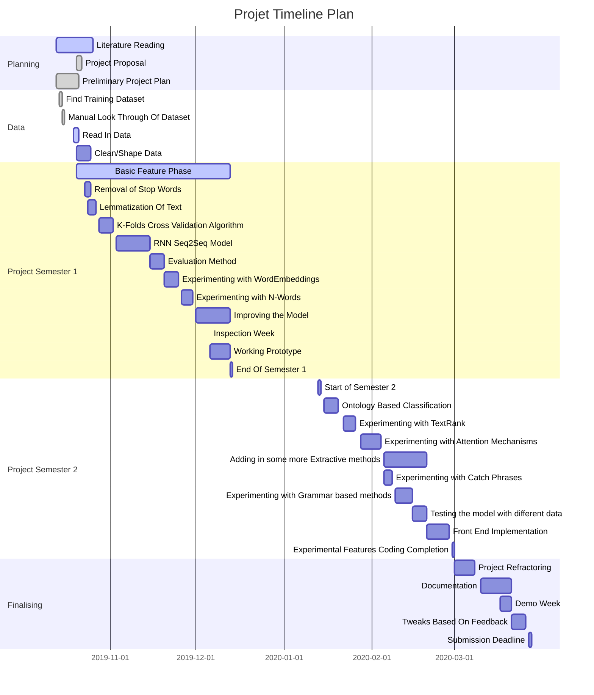

# Minimising the Universe.
## Finding the Optimal Summary Using Abstractive Summarization Methods.

### Data
The ideal dataset would be one with predefined summaries, in addition to the main body of the text. The most applicable data would be news articles, and you could consider news article headlines to be summaries (as long as the source is not The Sun) 

The aim would then be to find another dataset, one that is perhaps a different type of body of text, and explore how well the model can summarise the given corpora.

Any data used will need to be cleaned and shaped. This will include techniques such as removal of stop words, and lemmatisation.

I have chosen to use is the DeepMid Q&A (https://cs.nyu.edu/~kcho/DMQA/) dataset, which has over 200k news articles that have been scraped from CNN and Daily Mail. As CNN has less data, I will begin with processing this.
* Each 'story' file has the following format
  * Body
  * @headline
  * Summary text
The first step of cleaning this data will be to separate the bodies and summaries into separate files so that it becomes easier to train and test data.

### Project Goals
1. Summarise large amounts of texts, into single lines or a singular paragraph
2. Produce easy to interpret outputs
3. Ensure summarised text is comprehensible and grammatically correct.
4. Try and achieve a validation accuracy of 70% (not sure how feasible this is at the current stage)
5. Use a variety of NLP techniques, where applicable
6. Comparing abstractive and extractive text summarization techniques

### Project Approach
There are two types of text summarization approaches: 
- Extractive
  - Selecting phrases from the text and ranking them to deduce which is most relevant to the meaning of the corpus.
- Abstractive
  - Generating a new phrase based on the corpus content, that effectively captures its' meaning.

Historically, it seems extractive has been a more successful approach due to its ease of implementation in comparison the abstractive summarization. The results derived from abstractive methods do however prove to be more general and "human-like".

Text summarisation can be achieved through both unsupervised and supervised methods, with supervised approaches (like Neural Networks), potentially deriving better results. 

The simplest approach of achieving summarisation is to extract keywords from a text, based on statistical methods such as TF-IDF, word embeddings (Word2Vec), and TextRank.

To extract phrases and sentence of high importance, the use of N-Grams along with these statistical methods will be imperative.

To achieve a Neural Networks/Deep Learning-based approach, ML libraries such as TensorFlow, Keras or Pytorch would be used, otherwise, the project would steer more towards creating ML algorithms. 

From initial reading around the subject, it seems using Recurrent Neural Networks to produce a Sequence-to-Sequence based architecture are quite powerful for this task, and so this will be a potential starting point.

### Why Is This Important
In modern-day society, so much data available to us, and most of it is too long and laborious for the everyday person to read. Summaries have always proven to be the easiest and most practical method of allowing readers to understand aspects of documents. The appeal for a system that enables anyone to input text of any: size, format, or structure, and receive concise, well-structured summaries is valuable. Text summarization is also a task that speeds up other NLP problems such as sentiment analysis.
Over the past few years, a lot of text summarization algorithms have been implemented, with average performing extractive methods becoming trivial to implement. The main challenges with these methods are creating summaries that effectively convey the whole message in a human-like way. With the rise of deep learning, recurrent neural networks have been instrumental in driving abstractive based method, however there are still issues surrounding reproducing factual details and ensuring lack of repetition. 
Evaluation
The first stage of evaluating the model, will be to validate it using the testing data. There are some other more complex cross-validation models such as k-folds, which may be more comprehensive, and so if time permits, these may be worth exploring.

The best measure for evaluating would probably be accuracy. It's also important to have some form of human-based checking (once data has been summarised), to ensure that the text is "human-friendly".

In addition, there is the ROGUE metric - https://en.wikipedia.org/wiki/ROUGE_%28metric%29

### Cue Phrases
Sentences that begin with concluding phrases like "in summary", "in conclusion", "the most important" etc. can be considered as indicators of a potential summary of the document. 
It is apt to assign a higher score to sentences that contain cue words and phrases using the formula
    Cue-Phrase Score - (Number of Cue Phrases in the sentence / Total number of cue phrases in the document)

Ref : https://reader.elsevier.com/reader/sd/pii/S0957417413002601?token=010CE8840408FF777CA5D27B71A76694E192D34312B9C11EEAD1CD8B48560F327CE4E2821B7E466924E4E6FFB65BE8FA 2.2.1

## Project Plan

# Proposal
In modern-day society, so much data available to us, and most of it is too long and laborious for the everyday person to read. Summaries have always proven to be the easiest and most practical method of allowing readers to understand aspects of documents. The appeal for a system that enables anyone to input text of any: size, format, or structure, and receive concise, well-structured summaries is valuable. 
Over the past few years, a lot of text summarization algorithms have been implemented, with average performing extractive methods becoming trivial to implement. The main challenges with these methods are creating summaries that effectively convey the whole message in a human-like way. With the rise of deep learning, recurrent neural networks have been instrumental in driving abstractive based method, however there are still issues surrounding reproducing factual details and ensuring lack of repetition.  
As a consequence of discoviring this, I have chosen to experiment with the effect of combining abstractive and extractve methodologies.
I am looking to build a Sequence2Sequence based Recurrent Neural Network (RNN), in order to create a model capable of abstractive text summarization. To enhance the model, I will experiment with adding in a group of traditionally extractive summarization based methods, such as TextRank and Ontology-based classification, to see how they impact the models’ overall performance, particularly when dealing with different types of data (e.g. academic papers rather than news articles).
The most challenging part of this will be to create an initial machine learning model that can be easily adapted to accommodate for the introduction of these extractive 'modules'. Additionally, checking the minimised form of the text is grammatically and human-friendly will be quite challenging.

# Old 
I am looking to explore various abstractive methods, from those with Sequence2Sequence based RNN's, to those that use tools such as TextRank, to find the best summarization method, given a particular text. The most challenging aspect will be creating machine learning models and finding a way to decide on the best method to use for a corpora. 
Most of the literature I am planning to use are academic documentation, such as 'Abstractive Text Summarization using Sequence-to-sequence RNNs and Beyond.'