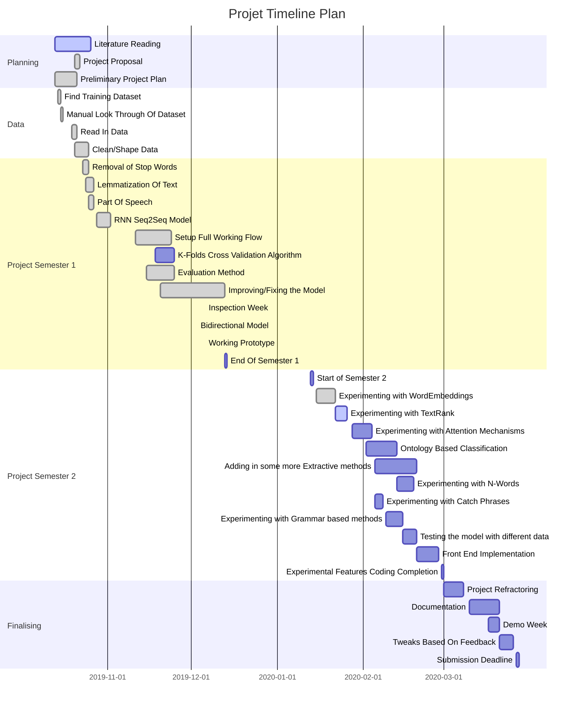
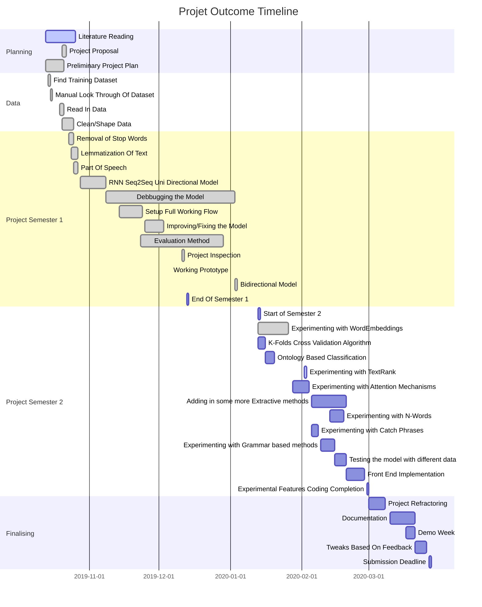

# Minimising the Universe.
## Finding the Optimal Summary Using Abstractive Summarization Methods.

### Setup
- Install required dependenices (required for first run)
    ```
    make setup 
    ```
- Install required python packages 
    </br> *only run if requirements have changed since make setup has been run  + no new nltk packages are required to be installed*
    ```
    pip install -r requirements.txt
    ```

### Run
- To run with default settigs
    ```
    make run
    ```
- To alter runtime variables
    ```
    make run TRAIN_DATA_PATH=<> OUTPUT_CSV=<>
    ```

### Proposal
In modern-day society, so much data available to us, and most of it is too long and laborious for the everyday person to read. Summaries have always proven to be the easiest and most practical method of allowing readers to understand aspects of documents. The appeal for a system that enables anyone to input text of any: size, format, or structure, and receive concise, well-structured summaries is valuable. 
Over the past few years, a lot of text summarization algorithms have been implemented, with average performing extractive methods becoming trivial to implement. The main challenges with these methods are creating summaries that effectively convey the whole message in a human-like way. With the rise of deep learning, recurrent neural networks have been instrumental in driving abstractive based method, however there are still issues surrounding reproducing factual details and ensuring lack of repetition.  
As a consequence of discoviring this, I have chosen to experiment with the effect of combining abstractive and extractve methodologies.
I am looking to build a Sequence2Sequence based Recurrent Neural Network (RNN), in order to create a model capable of abstractive text summarization. To enhance the model, I will experiment with adding in a group of traditionally extractive summarization based methods, such as TextRank and Ontology-based classification, to see how they impact the models’ overall performance, particularly when dealing with different types of data (e.g. academic papers rather than news articles).
The most challenging part of this will be to create an initial machine learning model that can be easily adapted to accommodate for the introduction of these extractive 'modules'. Additionally, checking the minimised form of the text is grammatically and human-friendly will be quite challenging.

### Project Plan



### Actual Outcome



### Flow

- Data processing
    - Read in data
    - Clean data
        - POS
        - Lemmatization
        - Stop Word Removal
    - Reshape data    
- Write dataframe to CSV
- Read CSV into model
- Model 
    - word embeddings
    - encoder
    - decoder
    - inference model
    - evaluation

