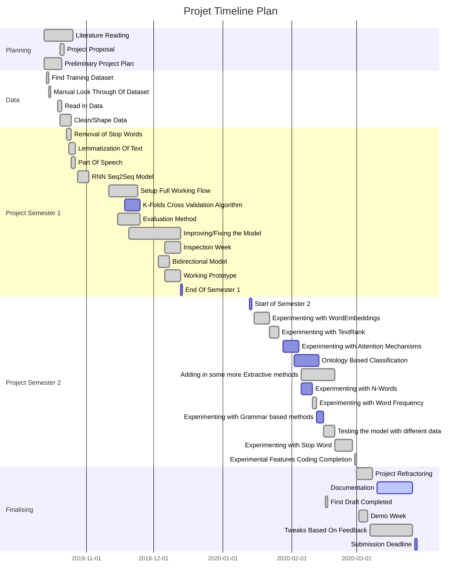
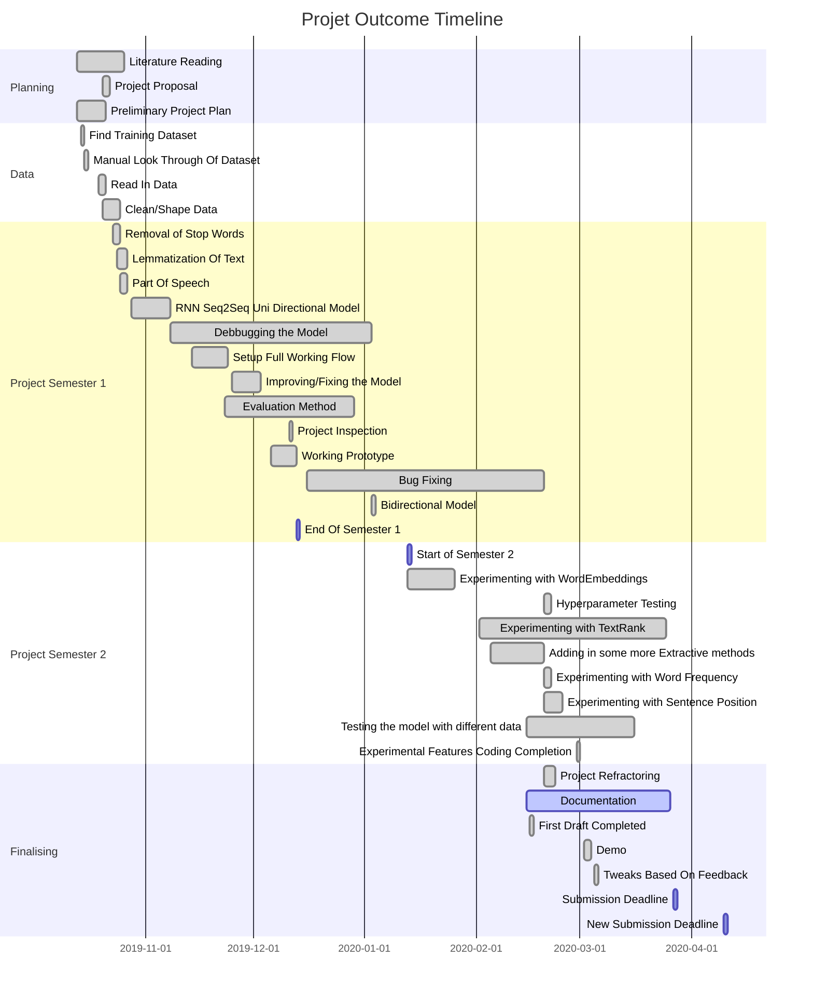

# Finding the Optimal Summary By Combining Extractive and Abstractive Summarization Methods.

In modern-day society, we are surrounded by data, most of which is too long and laborious for the everyday person to read comprehensively. With the art of generating extractive summaries becoming increasingly trivial, the challenge of producing abstractive summaries that can understand and convey the meaning of a document remains prominent within the field of natural language processing. Although summarisation is a task that humans can easily complete, developing automated approaches that can generalise well with different data formats remains a challenge. Despite a recent surge in research to improve abstractive summarisation methods, there are still outstanding issues regarding the validity of generated summaries. The method proposed experiments with combining extractive and abstractive summarisation methods, to evaluate whether these extractive methods can be effective in driving more human-like abstractive summaries. The overall aims and evaluators are the reduction of repetition, and the improvement of precision, recall and human-judged grammatical correctness.

## Setup
- This project requires Python 3.0+ to run.
- Install required dependencies (required for first run to ensure NLTK packages are installed)
    ```
    make setup 
    ```
- Install required python packages 
    </br> *only run if requirements have changed since make setup has been run  + no new NLTK packages are required to be installed*
    ```
    make requirements
    ```
- To run the GloVe model, download the pretrained word embeddings found [here](https://nlp.stanford.edu/projects/glove/) and ensure they are place on the specified path in a file named "glove".

## Run
- To run data processing with default settings (as shown below)
    ```
    make run-data
    ```
- To run model with default settings - bidirectional model
    ```
    make run-model
    ```
- To alter runtime variables follow the following example
    ```
    make run-data TRAIN_DATA_PATH=<> OUTPUT_CSV=<> ...
    ```

*Note: For any machine running python 3.0 via the python3 command, append -labs to the end of any make commands (e.g. make-setup-labs)*

## MakeFile
The default settings for all runtime variables that can be altered are shown below.
```
    ## Variables
    ### Data Processing
    TRAIN_DATA_PATH="./cnn/originals"
    OUTPUT_CSV="./data/cnn-tr.csv"
    TRAIN_DATA_PATH_LABS="/tmp/bhm699/dailymail/originals"
    OUTPUT_CSV_LABS="/tmp/bhm699/dailymail-wf.csv"

    STOP_WORDS=True
    LEMMATIZE=True
    LEMMATIZE_WITH_POS=True
    SENT_POS=False
    #### Only one of these can be true at any given time
    TEXT_RANK=False
    WORD_FREQ=False

    ### Model Running
    MODEL_ID=1  # 0 = unidirectional, 1=bidirectional, 2=GloVe model
    WORD_REMOVAL=False # remove words using uncommon_word_thr
    CSV_NAME="cnn-all.csv" # csv data to run model against
```

## Flow
- dataProcesing.py
    - Read in Data
    - Clean Data
        - Stop Word Removal
        - POS
        - Lemmatization
    - Extractive Methods
      - TextRank?
      - Word Frequency?
      - Sentence Position?
  - Write Dataframme to CSV
- modelCommon.py and models.py
  - Read CSV into Dataframe
  - Data Cleaning
  - Uncommon Word Removal?
  - Max Text Lengths
  - Training Validation Split
  - Word Embeddings  
    - Reshape Data  
    - Learning Model
      - Encoder
      - Decoder
      - Combined LSTM Model
      - Training
    - Inference Model
      - Encoder
      - Decoder
      - Reverse Word Embeddings
    - Evaluation
      - Validation Data
      - Training Data
      - Test Data

## Project Plan



### Actual Outcome

